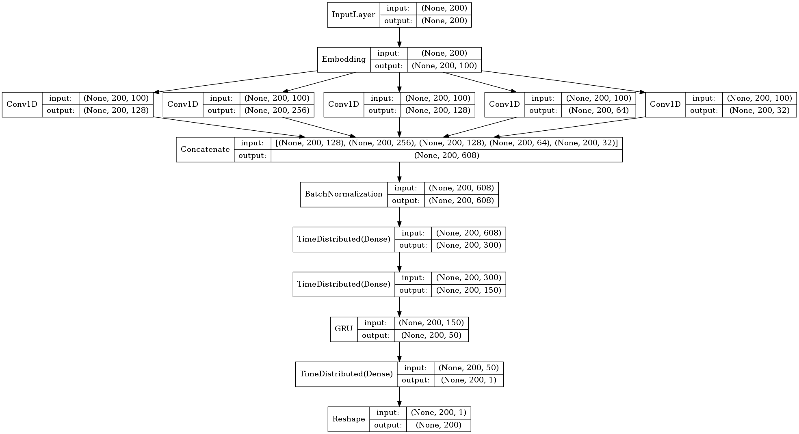

KoSpacing 
---------------

R package for automatic Korean word spacing.


[](http://www.gnu.org/licenses/gpl-3.0)


#### Introduction

Word spacing is one of the important parts of the preprocessing of Korean text analysis. Accurate spacing greatly affects the accuracy of subsequent text analysis. `KoSpacing` can help fairly accurate automatic word spacing performance, especially good for online text originated from SNS.

`KoSpacing` based on Deep Learning model trained from large corpus(more than 100 million NEWS articles from [Chan-Yub Park](https://github.com/mrchypark)). 


#### Performance

| Test Set  | Accuracy | 
|---|---|
| Sejong(colloquial style) Corpus(1M) | 97.1% |
| OOOO(literary style)  Corpus(3M)   | 94.3% |

- Accuracy = # correctly spaced characters/# characters in the test data.


#### Install

To install from GitHub, use

    install.packages(c('tensorflow', 'keras', 'hashmap', 'reticulate'))
    install.packages('devtools')
    devtools::install_github('haven-jeon/KoSpacing')


#### Example 

    library(KoSpacing)
    spacing("김형호영화시장분석가는'1987'의네이버영화정보네티즌10점평에서언급된단어들을지난해12월27일부터올해1월10일까지통계프로그램R과KoNLP패키지로텍스트마이닝하여분석했다.")
    [1] "김형호 영화시장 분석가는 '1987'의 네이버 영화 정보 네티즌 10점 평에서 언급된 단어들을 지난해 12월 27일부터 올해 1월 10일까지 통계 프로그램 R과 KoNLP 패키지로 텍스트마이닝하여 분석했다."


#### Citation

```markdowns
@misc{heewon2018,
author = {Heewon Jeon},
title = {Automatic Korean word spacing with R},
publisher = {GitHub},
journal = {GitHub repository},
howpublished = {\url{https://github.com/haven-jeon/KoSpacing}}
```

#### Model Architecture




